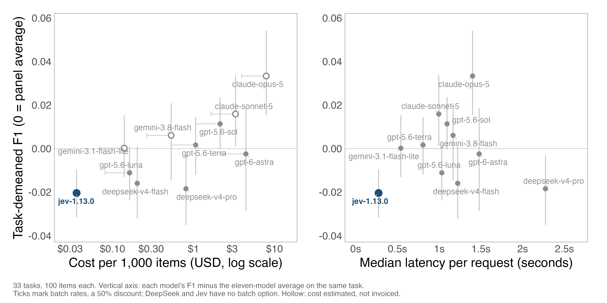
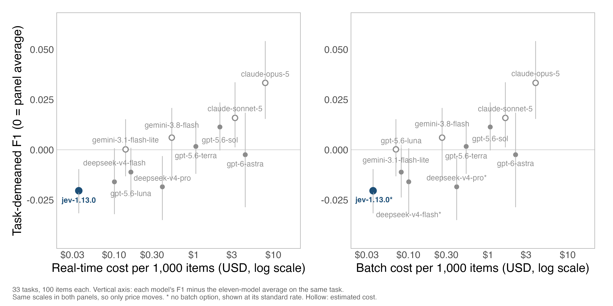

# polsci-open-bench

A benchmark of local open-weight and commercial API LLMs for political science
text classification.

The current release compares six local Ollama models with four commercial API
models from OpenAI, Anthropic, and DeepSeek on 33 classification tasks from
political science papers, public replication archives, and documented public
datasets. Two further experiments ask whether the measured API advantage is an
artifact of how the benchmark calls the two model groups, and how many
hand-coded labels a supervised classifier needs before it matches zero-shot
coding. The report is the authoritative project summary.

## Paper and Data

- PDF report: [`output/report_pdf.pdf`](output/report_pdf.pdf)
- Serial predictions: [`output/predictions.csv`](output/predictions.csv)
- Serial summary: [`output/summary.csv`](output/summary.csv)
- Prompt-batched predictions: [`output/predictions_batched.csv`](output/predictions_batched.csv)
- Prompt-batched summary: [`output/summary_batched.csv`](output/summary_batched.csv)
- Local 10-item batching summary: [`output/summary_batched_local_b10.csv`](output/summary_batched_local_b10.csv)
- Task inventory: [`docs/task_inventory.md`](docs/task_inventory.md)
- Supervised learning curves: [`output/supervised_baseline_e5.csv`](output/supervised_baseline_e5.csv),
  [`output/supervised_baseline_tfidf.csv`](output/supervised_baseline_tfidf.csv),
  per-task crossovers in [`output/supervised_crossover.csv`](output/supervised_crossover.csv)
- Change history: [`CHANGELOG.md`](CHANGELOG.md)

## Main Result

Local open-weight models are often competitive with commercial API models, but
the benchmark does not support a single global model ranking. The best local
model matches or exceeds the best API model on 9 of 33 tasks; on average, the
best API model exceeds the best local model by 0.013 F1. API models have their
clearest edge on complex tasks with many active labels, long codebooks, or
multiple outputs per item.

Two results support that reading rather than qualifying it.

**Constrained decoding does not explain the API advantage.** The published run
gave API models server-side JSON-schema enforcement and local models none, which
is a plausible alternative explanation for the gap. Running four open-weight
checkpoints twice over the same 16,425 items, once with schema-constrained
decoding and once without, moves mean F1 by 0.0014 against the constraint, with
a paired interval of [0.0000, 0.0028]. That is an order of magnitude smaller than
the 0.013 gap it was proposed to explain, so the difference between the two model
classes is a property of the models rather than of the harness.

**Zero-shot coding beats a supervised classifier trained on 2,000 labels per
task.** Frozen multilingual-E5 embeddings with logistic regression reach 0.672
mean F1 against 0.697 for the best local model given no labels at all, and the
curve has flattened, so the crossover lies in the low thousands of labels per
task. Representation matters more than the classifier: the same logistic
regression on TF-IDF features reaches 0.549, and on the Japanese task 0.098
against 0.736, because word-level features cannot segment Japanese.

For applied work, the practical recommendation is to test candidate models on
labeled examples from the target task and report both performance and unusable
output rates. Prompt batching can make local models faster, but it needs
task-specific reliability checks.

## API Model Comparison, September 2026

A separate panel re-runs 11 commercial API models on the same 33 tasks, 100
frozen items each, and adds the two axes the main benchmark does not measure:
what a model costs and how long a request takes.



**Cheap and fast does not mean competitive, but the gap is small.** Mean task F1
runs from 0.661 for Jev 1.13 to 0.714 for Claude Opus 5. Six of the ten
comparisons against Jev clear zero on a paired task bootstrap: both Claude
models, both Gemini Flash models, and two GPT-5.6 models. The other four are not
distinguishable from it.

**The cheapest model that clearly beats Jev is Gemini 3.1 Flash-Lite**, at $0.14
per 1,000 items against Jev's $0.036, for +0.021 F1. Jev remains the cheapest and
fastest model on the panel, at 0.27s median per request against Flash-Lite's
0.54s.



**Batch pricing halves the gap.** OpenAI, Anthropic and Google all discount batch
work by 50%; DeepSeek and Jev have no batch endpoint, so their price does not
move. At batch rates Flash-Lite costs about twice Jev rather than four times.

**Prompt optimisation does not close the gap for Jev.** Running GEPA on 30 tasks,
optimising on rows the benchmark never sampled and scoring on the untouched
frozen items, moves held-out F1 by +0.011 with a paired interval that contains
zero. The same prompts gained +0.048 on the rows used to select them, so 78% of
the apparent improvement was selection optimism rather than transferable gain.

Cost figures differ in how much they can be trusted. The four OpenAI models,
both DeepSeek models and Jev carry provider billing records; Gemini and Anthropic
are token counts times published prices and are drawn hollow on the figures. See
[`output/sidecar/jev_sidecar/summary.json`](output/sidecar/jev_sidecar/summary.json)
for the per-model basis.

## Benchmark Scope

- 33 active task manifests in [`tasks/`](tasks), plus one held out (see
  [`CHANGELOG.md`](CHANGELOG.md))
- 10 serial models: 6 local Ollama models and 4 commercial API models
- 330 serial task-model comparisons
- 164,250 serial model-item classifications
- 204 local prompt-batched task-model comparisons with 10 items per prompt
- 293 to 500 items per task
- Metrics: main F1, accuracy, MCC, time per item, and unusable-output rate
- Local hardware: Apple M2 Pro with 32 GB unified memory
- Constrained-decoding experiment: 4 open-weight checkpoints x 2 decoding modes
  x 16,425 items, on one RTX PRO 6000 GPU
- Supervised baselines: 2 classifiers x 6 training sizes x 5 draws across the 30
  tasks whose cleaned frame leaves a training remainder

The report's "main F1" column is named `headline_f1` in the CSV outputs.

## Reproduce

Create a Python environment:

```bash
python3 -m venv .venv
source .venv/bin/activate
python3 -m pip install -r requirements.txt
```

Basic checks:

```bash
python3 code/task_inventory.py --check
python3 -m unittest discover -s tests
```

Rebuild report assets and the PDF:

```bash
Rscript code/build_report_assets.R
quarto render output/report_pdf.qmd --to pdf
```

Running the full benchmark can call paid APIs if API keys are present. See
[`docs/reproduce.md`](docs/reproduce.md) for backend setup, model pulls, custom
tasks, custom models, cost notes, and full rerun commands.

## Documentation

- [`docs/status.md`](docs/status.md): current release state
- [`docs/reproduce.md`](docs/reproduce.md): setup and rerun instructions
- [`docs/schema.md`](docs/schema.md): output schema
- [`docs/prompts_provenance.md`](docs/prompts_provenance.md): prompt and task provenance
- [`CHANGELOG.md`](CHANGELOG.md): task-set, gold-label, prompt and metric changes
- [`docs/task_source_fidelity_audit.md`](docs/task_source_fidelity_audit.md): source-fidelity audit
- [`docs/custom_tasks.md`](docs/custom_tasks.md): custom task manifests
- [`docs/custom_models.md`](docs/custom_models.md): custom model manifests
- [`docs/release_workflow.md`](docs/release_workflow.md): release and arXiv workflow
- [`output/sidecar/jev_sidecar/`](output/sidecar/jev_sidecar): cost, latency and
  task-demeaned tables behind the API-comparison figures
- [`output/sidecar/gepa_jev_20260920/`](output/sidecar/gepa_jev_20260920): GEPA
  per-task results, including each optimised prompt

## Repo Layout

```text
code/         benchmark runners, analysis scripts and report builders
data/         cleaned task files
models/       model manifests
tasks/        task manifests for the current release
tasks_v2/     corrected manifests that supersede a v1 task (see CHANGELOG.md)
tasks_ext/    candidate tasks not yet in the headline panel
prompts/      task prompts
prompts_v2/   prompts belonging to the v2 manifests
experiments/  run configurations for the side experiments
output/       predictions, summaries, figures, tables, reports
docs/         documentation
examples/     minimal custom-task and custom-model examples
tests/        unit tests
```

Raw per-request responses live under `output/sidecar/` and are not tracked:
they run to tens of thousands of files. The small derived tables the figure
scripts read are tracked, so the figures rebuild from a clone.

## Citation

If you use this benchmark in academic work, please cite the report and the
source papers for the individual tasks listed in
[`docs/prompts_provenance.md`](docs/prompts_provenance.md).

## License

Code: MIT, see [`LICENSE`](LICENSE).

Data: task CSVs are derived from public replication archives and documented
public datasets. Task-level data licenses inherit from the source paper or
source dataset.
