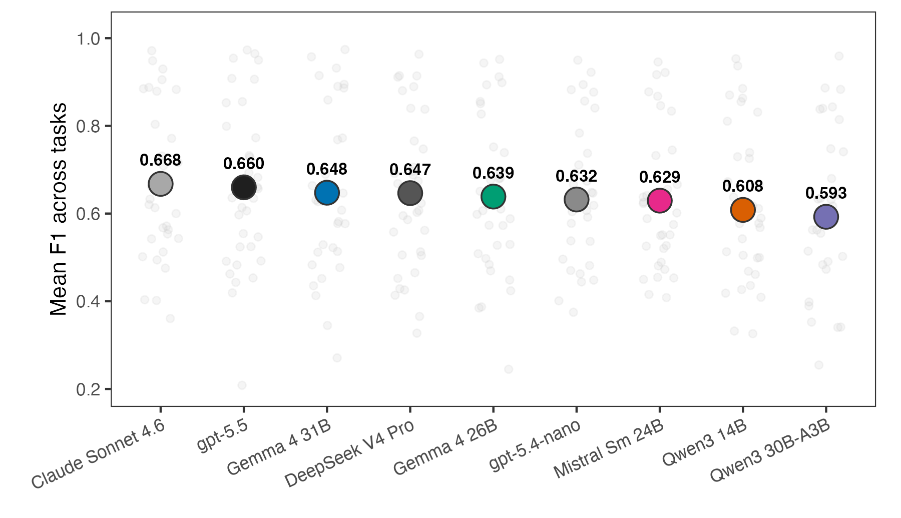
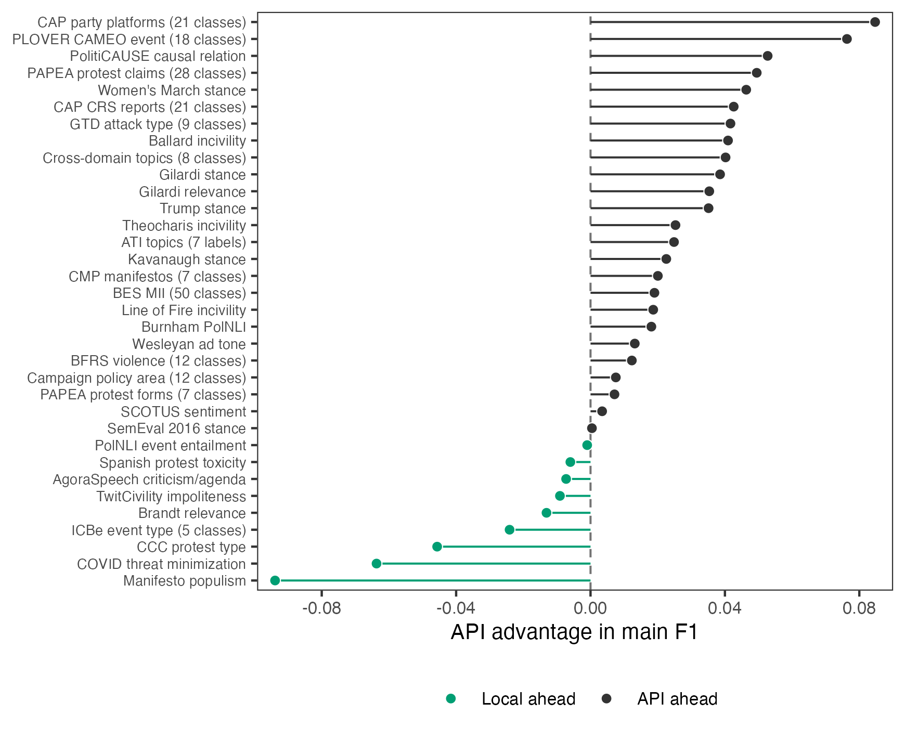
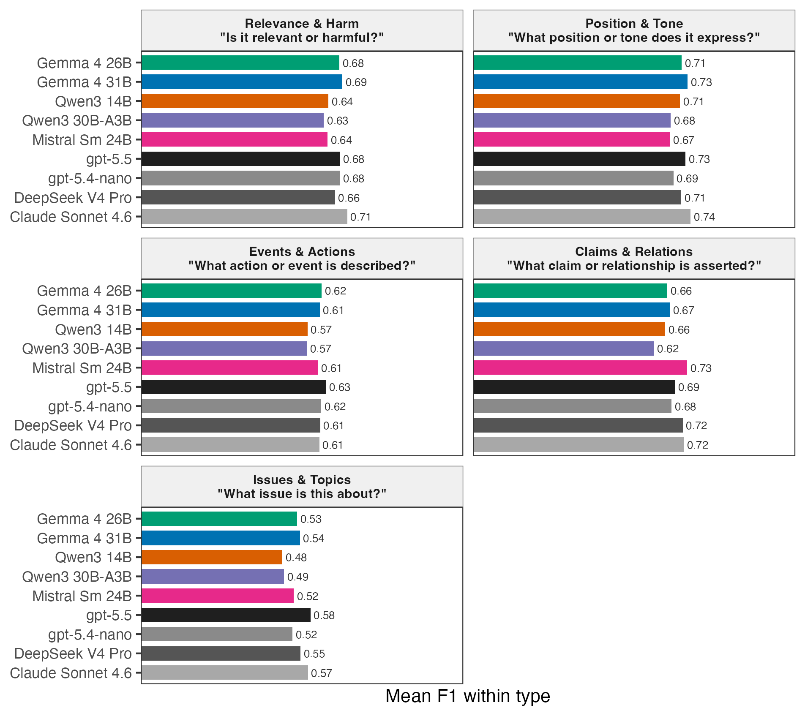
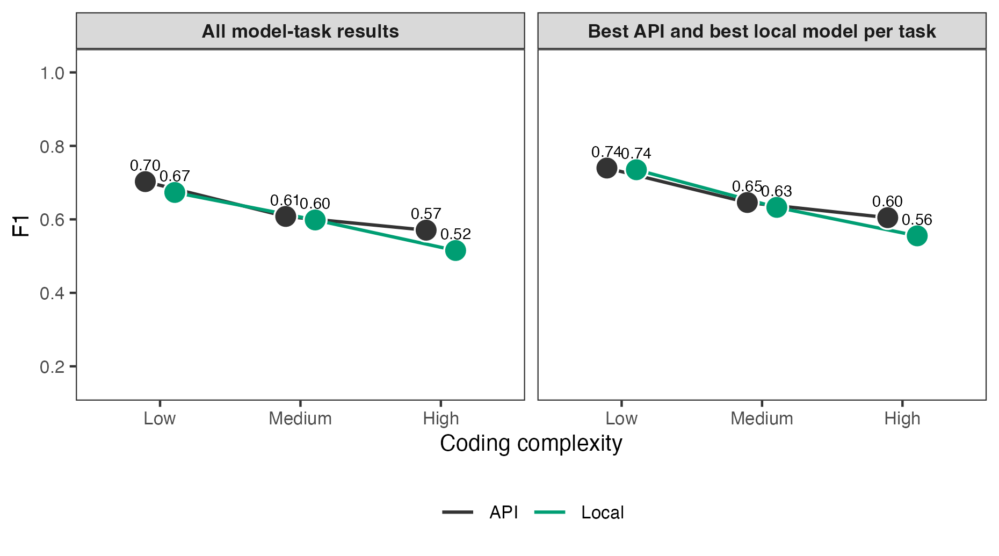
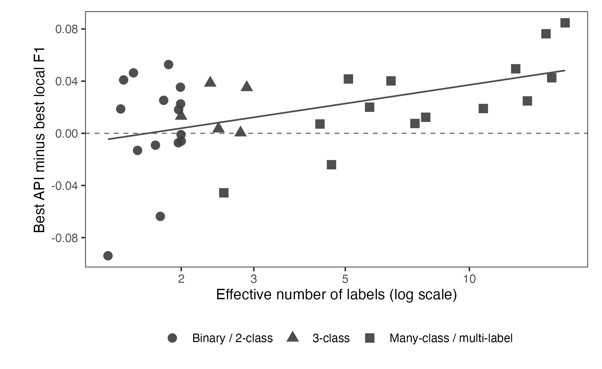
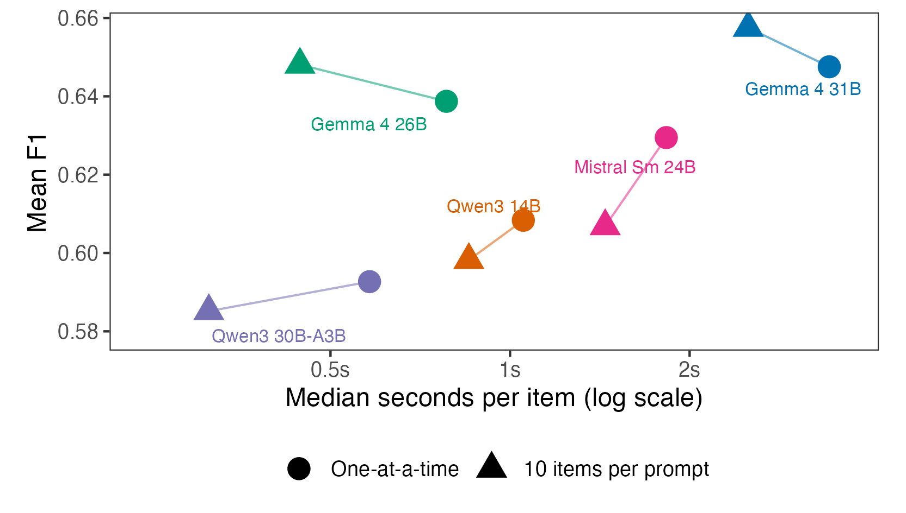
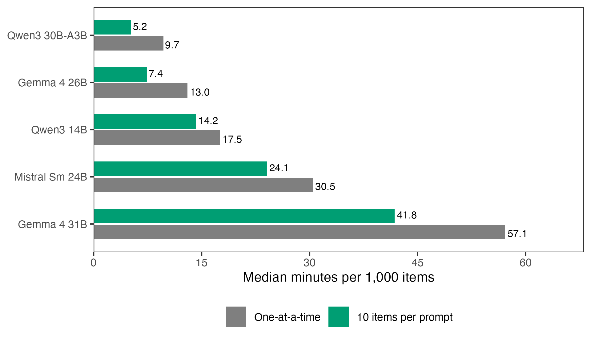

```{r setup, include=FALSE}
knitr::opts_knit$set(root.dir = getwd())
knitr::opts_chunk$set(echo = FALSE, message = FALSE, warning = FALSE,
                      fig.align = "center", dpi = 200)
library(knitr)

include_table <- function(path) {
  cat(readLines(path, warn = FALSE), sep = "\n")
}
```

## Abstract {.unnumbered}

Local open-weight models for LLM text classification have several advantages: they avoid API costs, keep data on the researcher's machine, and make exact model versions easier to preserve. I benchmark five local models against four commercial API models on 34 political science classification tasks. Local models are competitive, especially on simpler tasks. Comparing the best local and best API model within each task, local models match or exceed API performance on 9 tasks. On average, the best API model exceeds the best local model by 0.015 on the main F1 score. The four strongest models, Claude Sonnet 4.6, gpt-5.5, Gemma 4 31B, and DeepSeek V4 Pro, fall within 0.021 mean F1. API models have their clearest edge on complex tasks with many labels or multiple outputs per item. Batching several items in one prompt usually reduces local runtime per item, but this sometimes returns invalid response formats. Overall, local open-weight models are a practical alternative for many political science classification tasks, provided researchers validate candidate models on task-specific labels and check batching reliability before scaling up.

# Motivation

When using LLMs to classify text data, researchers can use commercial API models or local open-weight models. Commercial API models are typically reliable and easy to call from R or Python. However, they cost money per API call, send data off-machine, and create reproducibility risk when model behavior changes over time. The alternative is local open-weight models. These models are free to run, keep the data on the researcher's machine, and make exact model versions easier to preserve and track. This matters when researchers work with restricted data or when data-use rules prohibit third-party APIs. Open-weight models can also be useful when research funds are not abundant, or for exploratory tasks that may otherwise not be pursued because of costs.

This benchmark focuses on three questions: whether local models approach commercial API performance, how long local classification takes, and when task complexity widens the API advantage. I use 34 tasks from published political science replication archives because they cover the kinds of coding problems applied researchers routinely face: relevance, stance, tone, events, claims, relations, issues, and topics.

The main result is practical rather than a single leaderboard. Local models are often close to API models, especially on simpler tasks, but performance varies enough across tasks that researchers should validate candidate models on the target coding problem. APIs retain their clearest edge on more complex tasks. Prompt batching can reduce local runtime, but only after checking invalid-output rates.

# Design

The benchmark has two parts. First, I run a one-item-at-a-time benchmark covering thirty-four classification tasks drawn from published political science replication archives and nine models: five local open-weight models and four commercial API models from OpenAI, Anthropic, and DeepSeek. This produces 306 model-task comparisons. Each model sees the same items within a task. Thirty-one tasks use 500 sampled items. Three tasks have fewer cleaned items available, so I use all available items: 320 for Brandt political relevance, 312 for PLOVER CAMEO event coding, and 293 for COVID threat minimization. This is why task sizes range from 293 to 500 items.

I report performance and reliability for each task and model. The main F1 score puts precision and recall on the same scale. For binary tasks, I use the F1 score for the positive class, the harmonic mean of precision and recall. For multi-binary tasks, I average the per-label F1 scores. For single-label categorical tasks, I use macro F1, which gives each observed class equal weight before averaging. Accuracy is the share of items classified correctly. Matthews correlation coefficient (MCC) summarizes overall agreement while accounting for false positives and false negatives. I report all three because class imbalance is common: macro-style F1 highlights rare-class performance, accuracy gives the plain success rate, and MCC is less sensitive than accuracy to majority-class dominance.

I also record time per item and the share of unusable responses. A response is unusable if it fails to parse, returns the wrong object shape, or uses a label outside the allowed label set. I compute performance metrics over usable outputs only, so failure rates need to be read alongside F1, accuracy, and MCC.

I ran each model on each item once in the one-item-at-a-time benchmark. The local setup was a single Apple Silicon MacBook with 32 GB of unified memory running Ollama at temperature 0.1. Commercial API calls used provider-specific constrained-output settings. OpenAI tiers used `reasoning_effort=medium`; DeepSeek ran with internal thinking disabled; OpenAI and DeepSeek returned JSON-constrained outputs; and Anthropic used tool use to constrain labels. I use the source paper's coding instructions verbatim where possible; otherwise, I derive prompts from the published codebook (see Table \ref{tab:tasks}).

Second, I test whether prompt batching speeds up local inference. In the batching experiment, the model receives ten items in one prompt and returns ten labels in a single response. This tests whether batching reduces time per item without changing the classification task. The local grid with 10 items per prompt covers all thirty-four tasks and all five local models.

The one-item-at-a-time benchmark is the basis for all main performance comparisons. I treat prompt batching as a separate speed and reliability check because it changes the format of the model call and can change invalid-output rates. Separating the two designs keeps the performance comparison clean while still showing whether local use is practical at larger scale.

Finally, I use uncertainty checks to avoid overinterpreting small differences. Within-task comparisons use 95% paired-by-item bootstrap confidence intervals (1000 iterations). I treat the thirty-four tasks as a fixed benchmark population, but also report paired task-level bootstrap intervals that resample tasks with replacement.

# Results

## Average performance 

Figure \ref{fig-mean-f1} shows the 34-task model averages and the spread of task-level performance within each model. Claude Sonnet 4.6 has the highest observed mean F1 (0.668), followed by gpt-5.5 (0.660), Gemma 4 31B (0.648), and DeepSeek V4 Pro (0.647). The spread across these four models is 0.021 points. The same broad top group appears under mean accuracy and mean MCC (Table \ref{tab:altmetrics}), although the exact order changes slightly. Among the OpenAI tiers, gpt-5.4-nano remains the cost-efficient option, at 0.632 mean F1 compared with 0.660 for gpt-5.5.

The task-level bootstrap gives the same result (Table \ref{tab:task-bootstrap}). The Claude Sonnet 4.6 versus gpt-5.5 interval includes zero, Gemma 4 31B and DeepSeek V4 Pro are effectively tied, and the estimated Claude advantage over Gemma 4 31B and DeepSeek V4 Pro is about two F1 points. Many within-task leader differences are also too uncertain to treat as firm rankings. In practice, these small average gaps are not enough to rank the models reliably.

```{r fig-mean-f1, out.width="0.82\\linewidth", fig.cap="Mean F1 across thirty-four tasks per model. Large filled circles show 34-task means. Small gray dots show observed per-task main F1 values. \\label{fig-mean-f1}"}

```

The local/API comparison in Figure \ref{fig-best-local-api-gap} directly addresses the paper's main question. After selecting the best model within each class for each task, the best local model matches or exceeds the best API model on 9 of the 34 tasks. On average, the best API model exceeds the best local model by 0.015 F1, and the median API advantage is 0.019. Figure \ref{fig-best-local-api-gap} uses the same sign convention: values below zero favor local models and values above zero favor API models. This is not evidence that local models dominate API models. It shows that the API advantage is often small enough that local model calls are worth validating on the target task.

```{r fig-best-local-api-gap, out.width="0.74\\linewidth", fig.pos="!htbp", fig.cap="API advantage in main F1 by task. Values below zero favor the local model class; values above zero favor the API model class. \\label{fig-best-local-api-gap}"}

```

Table \ref{tab:model-selection-value} reports how much performance would improve if researchers could choose the best model separately for each task. These upper bounds choose the best model after observing performance on each task. Allowing the local model to vary by task raises mean F1 from 0.648 for the best single local model to 0.673. Across all nine models, task-specific selection reaches 0.696, compared with 0.668 for the best single model. These values show why task-specific validation can be valuable, but they do not show how large a validation sample is needed to choose models reliably.

The larger differences are across tasks. The paired-by-item intervals are wide enough that many task-level leader differences remain uncertain. I therefore do not read the benchmark primarily as a leaderboard: global rank is a weak decision rule for applied coding.

## Different models lead on different tasks

Figure \ref{fig-family} groups the thirty-four tasks into five broad annotation types: relevance and harm, position and tone, events and actions, claims and relations, and issues and topics. These are my groupings, not source-provided task families, and I assign borderline cases by the prediction target. The full task list is in Table \ref{tab:tasks}. The type-level averages do not show a simple local versus API pattern.

At the task level, the top point estimates are split across eight models (Table \ref{tab:winners}). gpt-5.5 leads on thirteen tasks, Claude Sonnet 4.6 leads on eight, Mistral Small leads on three, and five other models lead on two tasks each.

The winner split matters because model strengths differ by task. Even models with lower average performance sometimes produce the best task-level point estimate. A model that is weaker on average can still be the best model for a specific task.

```{r fig-family, out.width="0.86\\linewidth", fig.cap="Mean F1 within five broad annotation types, by model. Type-level averages are descriptive only. \\label{fig-family}"}

```

## Performance is lower on more complex coding tasks

Figure \ref{fig-complexity} examines whether coding complexity explains the large task-to-task variation. I measure complexity with two features that researchers can observe before running a benchmark: the prompt/codebook and the number of labels used in the gold data. Low-complexity tasks have fewer than three effective labels and short prompts. Medium-complexity tasks have either more labels or longer prompts. High-complexity tasks have at least eight effective labels or require multi-binary outputs.

Performance falls as coding tasks become more complex, but local models remain close on many tasks. Mean F1 falls from 0.70 to 0.57 for API model-task pairs and from 0.67 to 0.52 for local pairs as tasks move from low to high complexity. When I instead compare the best API model with the best local model on each task, the low-complexity gap nearly disappears (0.740 versus 0.735), while the high-complexity gap is about 0.05 F1 (0.605 versus 0.555). This is the clearest API edge in the complexity groups: long codebooks, many effective labels, and tasks with multiple outputs per item.

```{r fig-complexity, out.width="0.84\\linewidth", fig.cap="Coding complexity and model performance across the 34-task benchmark. The left panel shows mean F1 across all model-task results, separately for local and API models. The right panel shows the best local model and best API model per task within each complexity group. Points show group means; lines connect complexity groups within model class. \\label{fig-complexity}"}

```

Figure \ref{fig-label-structure-gap} shows one reason for the complexity result: tasks with more actively used labels tend to show larger API advantages. Effective label count measures how many labels actually matter in the sample, rather than simply counting every possible label. The relationship is positive. The simple correlation between effective label count and the API-minus-local gap is about 0.50. Binary and two-class tasks have a mean API advantage of 0.004, while many-class or multi-label tasks have a mean API advantage of 0.025.

```{r fig-label-structure-gap, out.width="0.70\\linewidth", fig.cap="API advantage in main F1 by effective number of labels. The dashed horizontal line marks equal performance; the solid line is a descriptive linear fit across tasks. \\label{fig-label-structure-gap}"}

```

## Local inference is not uniformly slower

Local inference speed varies sharply with model size, model design, and batching (Figure \ref{fig-speed}). On a typical 500-item task, median one-item-at-a-time runtimes range from about 5 minutes for Qwen3-30B-A3B and 7 minutes for Gemma 4 26B to about 29 minutes for Gemma 4 31B. Qwen3-30B-A3B is fastest because it is a sparse model that uses about three billion active parameters per call. Gemma 4 31B has the strongest local 34-task one-item-at-a-time F1, while Gemma 4 26B is much faster and remains close on average. Local inference is slow enough to plan around, but not slow enough to rule out ordinary validation and production coding.

```{r fig-speed, out.width="0.72\\linewidth", fig.pos="!htbp", fig.cap="Mean F1 vs median runtime per item, for the five local models. Circles show one-at-a-time calls over the 34-task benchmark; triangles show calls with 10 items per prompt over the same task set. Lines connect the two call modes for the same model, and labels identify model pairs. API models are excluded because their per-call time mixes server load, queueing, and network delay and is not directly comparable to local inference time. \\label{fig-speed}"}

```

All five local models ran on a single 32 GB Apple Silicon MacBook; the largest, Gemma 4 31B, fit in unified memory. Appendix Figure \ref{fig-local-runtime-per-1000} translates the local runtimes into median minutes per 1,000 items for each model. For reference, the API tiers in this run took roughly 0.9 to 1.7 seconds per item end-to-end, but those numbers mix model speed with provider load, network delays, and queueing and are not shown in the figure.

## Batching speeds up local inference but can produce invalid output

Prompt batching changes the prompt: the model receives several items at once and must return one label for each item. Provider Batch API mode is different. It changes how requests are queued and billed, but each item still appears in a separate request. I test prompt batching here. @pipal2026 show why this matters for labeling tasks: one-at-a-time classification repeats the same prompt and request setup for every item.

Figure \ref{fig-speed} shows the main local result. Prompt batching reduces median runtime per item for every local model, with model-level median speedups from about 1.23× to 1.86×. Average F1 changes are modest, ranging from -0.023 to +0.010. Gemma 4 26B is the most useful fast batched option in these results: it remains close to Gemma 4 31B on average but classifies a typical 500-item task in about 4 minutes with 10 items per prompt, compared with about 21 minutes for Gemma 4 31B.

Batching helps less when prompts are long. Short-prompt model-task pairs have a median local speedup of about 1.34× with 10 items per prompt, while long-codebook pairs have a median speedup of about 1.20×. The bigger problem is invalid output: some models return invalid JSON, the wrong object shape, or labels outside the allowed set. The largest failures are concentrated in specific model-task pairs. For example, Gemma 4 26B produces unusable responses for 72% of Erlich ATI items with 10 items per prompt, and Qwen3-30B-A3B produces unusable responses for 51% of Halterman CCC items with 10 items per prompt. A separate OpenAI prompt-batching diagnostic also found that gpt-5.5 returned unusable output for 68% of Halterman CCC items. That OpenAI diagnostic does not enter the main one-item-at-a-time performance results. Table \ref{tab:malformed} lists the covered response-format and label failure rates above 5%.

## Cost

The OpenAI portion of the 34-task one-item-at-a-time benchmark remains cheap enough for benchmarking on a validation sample, but the tiers differ sharply. At publicly listed prices, gpt-5.4-nano costs about $4 for the 16,425 predictions in the 34-task benchmark, while gpt-5.5 would cost about $71 under direct per-request pricing. In return, gpt-5.5 improves mean F1 from 0.632 to 0.660. The smaller tier is therefore worth testing before moving to a flagship API model.

Provider Batch API mode changes the cost calculation for flagship models. This is provider-side request processing, not prompt batching with several items in one prompt. The gpt-5.5 runs for the 16-task extension subset used the OpenAI Batch API: 7,605 requests completed with 0 parse/API errors at an estimated batch-discounted cost of $14.13 under a $20 budget cap. I also ran Claude Sonnet 4.6 through provider Batch API mode for the same subset; 7,604 of 7,605 outputs parsed cleanly after retries. Local models avoid API charges, but the relevant cost becomes runtime, hardware availability, and energy use.

# Implications for applied use {.unnumbered}

The results suggest a simple validation step rather than a single best model. Start with 100 to 300 hand-labeled cases from the target task. Test one cheap API model, one flagship API model, and at least two local models. Report the main F1 score, accuracy, MCC, and the share of unusable responses. For imbalanced tasks, inspect rare-class recall as well.

Researchers should test batching on the same validation sample before production coding. In these results, 10 items per prompt usually reduces local runtime with little average performance loss, but the failure rate can be high for specific model-task pairs. For long, multi-class codebooks, researchers should not batch aggressively unless retries are built in.

All five local models fit on a 32 GB Apple Silicon MacBook, so one laptop setup is enough hardware for the full benchmark. When paid API use is acceptable, cheap tiers should also be tested rather than dismissed: in this run, gpt-5.4-nano lost 0.028 mean F1 relative to gpt-5.5 and cost about $4 for the full 34-task benchmark.

# Limitations and scope {.unnumbered}

**Model selection and prompting.** The model set reflects five specific local models that fit a 32 GB Apple Silicon setup, plus four commercial API tiers that include cheaper and flagship options. I did not optimize prompts separately per model. Some prompts use the source paper's wording; others come from published codebooks. 

**Beyond this benchmark.** Local inference keeps text on the researcher's machine, which can make sensitive or restricted text data easier to use. The benchmark studies prompt-based classification only. For large labeled datasets with fixed label sets, fine-tuned local models, supervised classifiers, or embedding-based methods may be cheaper and more reliable. API endpoints can change behavior between releases even when the model name is stable, while local open-weight models are easier to freeze exactly.

# References {.unnumbered}

::: {#refs}
:::

# Companion materials {.unnumbered}

Prompt sources, batching details, summary CSVs, and reproduction instructions are on the GitHub repository at <https://github.com/hhilbig/polsci-open-bench>.

```{=latex}
\begin{landscape}
```

# Tasks {.unnumbered}

```{r table-tasks-appendix, results="asis"}
include_table("tables/table-tasks-appendix.tex")
```

```{=latex}
\end{landscape}
```

# Per-task winners {.unnumbered}

```{r table-winners-appendix, results="asis"}
include_table("tables/table-winners-appendix.tex")
```

# Task-level uncertainty for model averages {.unnumbered}

```{r table-task-bootstrap-appendix, results="asis"}
include_table("tables/table-task-bootstrap-appendix.tex")
```

# Local runtime per 1,000 items {.unnumbered}

Figure \ref{fig-local-runtime-per-1000} converts local median runtime per item into minutes per 1,000 items. The bars for 10 items per prompt use the full 34-task local batching grid, so they should be read alongside the response-format and label failure checks below.

```{r fig-local-runtime-per-1000, out.width="0.82\\linewidth", fig.cap="Median local runtime per 1,000 items. One-at-a-time bars and bars for 10 items per prompt use the 34-task benchmark. Lower values are faster. Batching should be interpreted alongside response-format and label failure checks. \\label{fig-local-runtime-per-1000}"}

```

# Model-selection upper bounds {.unnumbered}

Figure \ref{fig-best-local-api-gap} in the main text compares the best local model with the best API model separately for each task. The largest API advantages appear on tasks that involve policy domains, event codes, causal relations, or protest claims. The largest local advantages appear on more focused tasks such as manifesto populism, COVID threat minimization, and CCC protest type.

```{r table-model-selection-value, results="asis"}
include_table("tables/table-model-selection-value.tex")
```

The best single model is Claude Sonnet 4.6, with a 34-task mean F1 of 0.668. The best single local model, Gemma 4 31B, reaches 0.648. If the local model can vary by task, the local task-specific upper bound rises to 0.673. The API upper bound reaches 0.688, and the all-model upper bound reaches 0.696. Because these rows choose after observing outcomes, they describe an upper bound on what validation can buy, not expected production performance.

# Response-format or label failure rates above 5 percent {.unnumbered}

```{r table-malformed-appendix, results="asis"}
include_table("tables/table-malformed-appendix.tex")
```

# Performance under alternative metrics {.unnumbered}

```{r table-altmetrics-appendix, results="asis"}
include_table("tables/table-altmetrics-appendix.tex")
```
