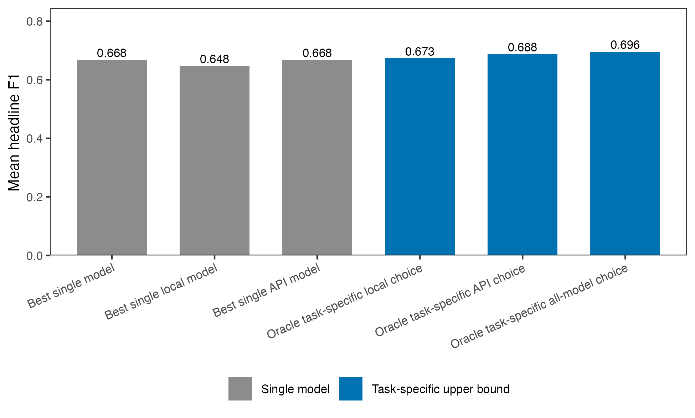

```{r setup, include=FALSE}
knitr::opts_knit$set(root.dir = getwd())
knitr::opts_chunk$set(echo = FALSE, message = FALSE, warning = FALSE,
                      fig.align = "center", dpi = 200)
library(knitr)

include_table <- function(path) {
  cat(readLines(path, warn = FALSE), sep = "\n")
}
```

## Abstract {.unnumbered}

Local open-weight models are useful tools for social-science text classification: they avoid per-item API fees, keep data on the researcher's machine, and make exact model versions easier to preserve. I benchmark five local models against four commercial API models on 34 political science classification tasks. Local models are competitive, but task choice matters. The best local model matches or exceeds the best API model on 9 tasks, and the average best-local-minus-best-API gap is -0.015 headline F1. The four strongest models, Claude Sonnet 4.6, gpt-5.5, Gemma 4 31B, and DeepSeek V4 Pro, fall within 0.021 mean headline F1. API models have their clearest edge on complex tasks with many labels or multiple outputs. Batching several texts in one prompt improves local throughput, but some task-model combinations return invalid labels or invalid response formats. The practical recommendation is simple: benchmark candidate models on ground-truth labels for the target task, report both performance and reliability, and test batching before using it at scale.

# Motivation

When using LLMs to classify text data, researchers can use commercial API models or local open-weight models. Commercial API models are typically reliable and easy to call from R or Python. However, they cost money per item, send data off-machine, and create reproducibility risk when model behavior changes over time. Local open-weight models are free to run, keep the data on the researcher's machine, and make exact model versions easier to preserve and track. This matters, for example, when data is restricted or cannot be sent to third-party APIs for other reasons. 

I run a benchmark of 34 classification tasks to assess the performance of local models across a range of applications. I am particularly interested in three questions: (i) when local models approach or exceed commercial API performance, (ii) how much local inference time researchers should expect, and (iii) when task complexity widens the local/API gap.

# Design

The benchmark has two parts. First, I run a single-item prompt benchmark covering thirty-four classification tasks drawn from published political science replication archives and nine models: five local open-weight models and four commercial API models from OpenAI, Anthropic, and DeepSeek. Each model sees the same items within a task. Thirty-one tasks use 500 sampled items. Three tasks have fewer cleaned items available, so I use all available observations: 320 for Brandt political relevance, 312 for PLOVER CAMEO event coding, and 293 for COVID threat minimization. This is why task sizes range from 293 to 500 observations.

I report performance and reliability for each task and model. The headline performance measure is F1, defined to match the task: positive-class F1 for binary tasks, mean per-label F1 for multi-binary tasks, and macro F1 for categorical tasks. Accuracy and Matthews correlation coefficient (MCC) provide additional measures of overall agreement. I also record wall-clock latency per item and the share of unusable responses. A response is unusable if it fails to parse, returns the wrong object shape, or uses a label outside the task schema. Performance metrics are computed over usable outputs only, so failure rates should be read alongside F1, accuracy, and MCC.

I ran each model on each item once in the single-item benchmark. The local setup was a single Apple Silicon MacBook with 32 GB of unified memory running Ollama at temperature 0.1. Commercial API calls used provider-specific constrained-output settings. OpenAI tiers used `reasoning_effort=medium`; DeepSeek ran with internal thinking disabled; OpenAI and DeepSeek returned JSON-constrained outputs; and Anthropic used tool use to constrain labels. Prompts are verbatim from the source paper's coding instructions where possible; otherwise, I derive them from the published codebook (see Table \ref{tab:tasks}).

Second, I test whether prompt batching speeds up local inference. In the b=10 batching experiment, the model receives ten texts in one prompt and returns ten labels in a single response. The point is to reduce per-item latency without changing the classification task. The local b=10 grid covers all thirty-four tasks and all five local models.

Within-task comparisons use 95% paired-by-item bootstrap confidence intervals (1000 iterations). I treat the thirty-four tasks as a fixed benchmark population, but also report paired task-level bootstrap intervals that resample tasks with replacement.

# Results

## Average performance 

Figure \ref{fig-mean-f1} shows the 34-task model averages and the spread of task-level performance within each model. Claude Sonnet 4.6 has the highest observed mean headline F1 (0.668), followed by gpt-5.5 (0.660), Gemma 4 31B (0.648), and DeepSeek V4 Pro (0.647). The spread across these four models is 0.021 points. The same broad top group appears under mean accuracy and mean MCC (Table \ref{tab:altmetrics}), although the exact order changes slightly. Among the OpenAI tiers, gpt-5.4-nano remains the cost-efficient option, at 0.632 mean headline F1 compared with 0.660 for gpt-5.5.

The task-level bootstrap corroborates this interpretation (Table \ref{tab:task-bootstrap}). The Claude Sonnet 4.6 versus gpt-5.5 interval includes zero, Gemma 4 31B and DeepSeek V4 Pro are effectively tied, and the estimated Claude advantage over Gemma 4 31B and DeepSeek V4 Pro is about two headline F1 points. Many within-task leader differences are also too uncertain to treat as firm rankings. The practical point is that small average gaps do not justify a stable leaderboard.

```{r fig-mean-f1, out.width="0.9\\linewidth", fig.cap="Mean headline F1 across thirty-four tasks per model. Large filled circles show 34-task means. Small gray dots show observed per-task headline F1 values. \\label{fig-mean-f1}"}
include_graphics("figures/fig-mean-f1.png")
```

The local/API comparison in Figure \ref{fig-best-local-api-gap} is the most direct test of my question. After selecting the best model within each class for each task, the best local model matches or exceeds the best API model on 9 of the 34 tasks. The mean best-local-minus-best-API gap is -0.015 headline F1, and the median gap is -0.019. Figure \ref{fig-best-local-api-gap} plots the same comparison as best API minus best local, so values to the left of zero favor local models. This is not evidence that local models dominate API models. It shows that the API advantage is often small enough that local inference is worth validating on the target task.

```{r fig-best-local-api-gap, out.width="0.8\\linewidth", fig.pos="H", fig.cap="Density of best API minus best local headline F1 across tasks. Negative values favor the local model class; positive values favor the API model class. The green area shows the local-favoring side of the distribution; the black area shows the API-favoring side. \\label{fig-best-local-api-gap}"}
include_graphics("figures/fig-best-local-api-gap.png")
```

The model selection upper bounds in Figure \ref{fig-model-selection-value} lead to the same conclusion. These upper bounds choose the best model after observing performance on each task. Allowing the local model to vary by task raises mean headline F1 from 0.648 for the best single local model to 0.673. Across all nine models, task-specific selection reaches 0.696, compared with 0.668 for the best single model. These values show the upside of task-specific validation, but not how large a validation sample is needed for reliable model selection.

The larger differences are across tasks. The paired-by-item intervals are wide enough that many task-level leader differences remain uncertain. The benchmark should therefore not be read primarily as a leaderboard: global rank is a weak decision rule for applied coding.

## Models are complementary across tasks

Figure \ref{fig-family} groups the thirty-four tasks into five broad annotation types: relevance and harm, position and tone, events and actions, claims and relations, and issues and topics. These are report groupings, not source-provided task families, and borderline cases are assigned by prediction target. The type-level averages do not show a simple local versus API pattern.

At the task level, the top point estimates are split across eight models. gpt-5.5 leads on thirteen tasks, Claude Sonnet 4.6 leads on eight, Mistral Small leads on three, and five other models lead on two tasks each.

The winner split matters because it suggests complementarity across models. Even models with lower average performance sometimes produce the best task-level point estimate. The models are not simply ordered by a single general-capability scale.

```{r fig-family, out.width="0.95\\linewidth", fig.cap="Mean headline F1 within five broad annotation types, by model. Type-level averages are descriptive only. \\label{fig-family}"}
include_graphics("figures/fig-family.png")
```

## Performance is lower on more complex coding tasks

Figure \ref{fig-complexity} asks whether coding complexity helps explain the large task-to-task variation. I measure complexity with two features that researchers can observe before running a benchmark: the prompt/codebook and the number of labels used in the gold data. Low-complexity tasks have fewer than three effective labels and short prompts. Medium-complexity tasks have either more labels or longer prompts. High-complexity tasks have at least eight effective labels or require multi-binary outputs.

The pattern is clear, but the gaps are not large enough to erase local competitiveness. Mean headline F1 falls from 0.70 to 0.57 for API model-task cells and from 0.67 to 0.52 for local cells as tasks move from low to high complexity. When I instead compare the best API model with the best local model on each task, the low-complexity gap nearly disappears (0.740 versus 0.735), while the high-complexity gap is about 0.05 headline F1 (0.605 versus 0.555). This is the clearest API edge in the complexity bins. It points to the tasks where validation matters most: long codebooks, many effective labels, and multi-output schemas.

```{r fig-complexity, out.width="0.92\\linewidth", fig.cap="Coding complexity and model performance across the 34-task benchmark. The left panel shows mean headline F1 across all observed task-model combinations, separately for local and API models. The right panel shows the best local model and best API model per task within each complexity group. Points show group means; lines connect complexity groups within model class. \\label{fig-complexity}"}
include_graphics("figures/fig-complexity.png")
```

## Local inference is not uniformly slower

Local inference speed varies sharply with model size, architecture, and batching (Figure \ref{fig-speed}). On a typical 500-item task, median single-item runtimes range from about 5 minutes for Qwen3-30B-A3B and 7 minutes for Gemma 4 26B to about 29 minutes for Gemma 4 31B. Qwen3-30B-A3B is fastest because it is a sparse model that uses about three billion active parameters per call. Gemma 4 31B has the strongest local 34-task single-item headline F1, while Gemma 4 26B is much faster and remains close on average. The point is practical: local inference is slow enough to plan around, but not slow enough to rule out ordinary validation and production coding.

```{r fig-speed, out.width="0.85\\linewidth", fig.pos="H", fig.cap="Mean headline F1 vs median per-item latency, for the five local models. Circles show single-item calls over the 34-task benchmark; triangles show b=10 batched calls over the same task set. Lines connect the two call modes for the same model, and labels identify model pairs. API models are excluded because their per-call wall-clock mixes server load, queueing, and network round-trip and is not directly comparable to local inference time. \\label{fig-speed}"}
include_graphics("figures/fig-speed.png")
```

All five local models ran on a single 32 GB Apple Silicon MacBook; the largest, Gemma 4 31B, fit in unified memory. Appendix Figure \ref{fig-local-runtime-per-1000} translates the local latencies into median minutes per 1,000 observations for each model. For reference, the API tiers in this run sat between roughly 0.9 and 1.7 s/item on median latency end-to-end, but those numbers mix model speed with provider serving load, network, and queueing and are not shown in the figure.

## Batching improves throughput but exposes reliability failures

Prompt batching changes the prompt: the model receives several texts at once and must return one label for each text. Provider Batch API mode is different. It changes how requests are queued and billed, but each text still appears in a separate request. The procedure I test here is prompt batching. @pipal2026 show why this matters for annotation workflows: one-at-a-time classification leaves much of the available throughput unused.

Figure \ref{fig-speed} shows the main local result. Prompt batching reduces median per-item latency for every local model, with model-level median speedups from about 1.23× to 1.86×. Average headline-F1 changes are modest, ranging from -0.023 to +0.010. Gemma 4 26B is the most useful fast batched option in these results: it remains close to Gemma 4 31B on average but classifies a typical 500-item task in about 4 minutes at b=10, compared with about 21 minutes for Gemma 4 31B.

Prompt length still matters. Short-prompt cells have a median local b=10 speedup of about 1.34×, while long-codebook cells have a median speedup of about 1.20×. Schema and label reliability is the sharper constraint. These failures include outputs that do not parse, outputs with the wrong object or array shape, and outputs that parse but return labels outside the permitted task schema. The largest failures are concentrated in specific model-task pairs. For example, Gemma 4 26B produces unusable responses for 72% of Erlich ATI items at b=10, Qwen3-30B-A3B produces unusable responses for 51% of Halterman CCC items at b=10, and gpt-5.5 returns unusable output for 68% of Halterman CCC items in the limited API prompt-batching run. The appendix table on schema and label failure rates lists the covered cells above 5%.

## Cost

The OpenAI portion of the 34-task single-item benchmark remains cheap enough for validation-scale benchmarking, but the tiers differ sharply. At publicly listed prices, gpt-5.4-nano costs about $4 for the 16,425 predictions in the 34-task benchmark, while gpt-5.5 would cost about $71 under direct per-request pricing. In return, gpt-5.5 improves mean headline F1 from 0.632 to 0.660. The smaller tier is therefore worth screening before moving to a flagship API model.

Provider Batch API mode changes the cost calculation for flagship models. The gpt-5.5 runs for a 16-task subset used the OpenAI Batch API: 7,605 requests completed with 0 parse/API errors at an estimated batch-discounted cost of $14.13 under a $20 budget cap. Claude Sonnet 4.6 was also run through provider Batch API mode for the same subset, with 7,604 of 7,605 outputs parsing cleanly after retries. Local models avoid API charges, but the relevant cost becomes wall-clock time, hardware availability, and energy use.

# Implications for applied use {.unnumbered}

The results imply a workflow rather than a single best model. Start with a small validation sample on the target task: the benchmark average does not reliably predict which model performs best on a specific task. All five local models fit on a 32 GB Apple Silicon MacBook, so one laptop setup is enough hardware for the full benchmark.

```{=latex}
\noindent\fbox{\begin{minipage}{0.94\linewidth}
\textbf{Recommended workflow.} Start with 100 to 300 hand-labeled validation cases. Test at least one cheap API model, one flagship API model, and two useful local models. Report headline F1, accuracy, MCC, and schema or label failures. For imbalanced tasks, inspect rare-class recall. Use batching only after checking task-level schema reliability, and freeze the exact model version before production coding.
\end{minipage}}
```

For metric reporting on imbalanced label sets, headline F1, accuracy, and MCC should appear together because each answers a different question. Mellon BES MII, a heavily imbalanced issue-classification task, illustrates the point: for the top model, headline F1 is about 0.55, accuracy is 0.95, and MCC is 0.93. When paid API use is acceptable, cheap tiers should also be screened rather than dismissed: in this run, gpt-5.4-nano lost 0.028 mean headline F1 relative to gpt-5.5 but cost about $4 for the full 34-task benchmark.

For batching, b=10 is a reasonable starting point for local models when throughput matters. The average performance cost is small, but schema and label reliability must be checked at the task-model level. For long, multi-class codebooks, researchers should not batch aggressively unless retries are built in.

# Limitations and scope {.unnumbered}

**Model selection and prompting.** The model set reflects five specific local models that fit a 32 GB Apple Silicon setup, plus four commercial API tiers that include cheaper and flagship options. I did not optimize prompts separately per model. Some are verbatim from the source paper, others are derived from published codebooks. 

**Beyond this benchmark.** Local inference keeps text on the researcher's machine, which can simplify workflows with sensitive or restricted data. The benchmark studies prompt-based classification only: for large labeled datasets with fixed label sets, fine-tuned local models, supervised classifiers, or embedding-based methods may be cheaper and more reliable. API endpoints can change behavior between releases even when the model name is stable, while local open-weight models are easier to freeze exactly.

# References {.unnumbered}

::: {#refs}
:::

# Companion materials {.unnumbered}

Prompt provenance, batched inference details, summary CSVs, and reproduction instructions are on the GitHub repository at <https://github.com/hhilbig/polsci-open-bench>.

```{=latex}
\begin{landscape}
```

# Tasks {.unnumbered}

```{r table-tasks-appendix, results="asis"}
include_table("tables/table-tasks-appendix.tex")
```

```{=latex}
\end{landscape}
```

# Per-task winners {.unnumbered}

```{r table-winners-appendix, results="asis"}
include_table("tables/table-winners-appendix.tex")
```

# Task-level uncertainty for model averages {.unnumbered}

```{r table-task-bootstrap-appendix, results="asis"}
include_table("tables/table-task-bootstrap-appendix.tex")
```

# Local runtime per 1,000 observations {.unnumbered}

Figure \ref{fig-local-runtime-per-1000} converts local median per-item latency into minutes per 1,000 observations. The b=10 bars use the full 34-task local batching grid, so they should be read alongside the schema and label reliability checks below.

```{r fig-local-runtime-per-1000, out.width="0.9\\linewidth", fig.cap="Median local runtime per 1,000 observations. Single-item and b=10 bars use the 34-task benchmark. Lower values are faster. Batching should be interpreted alongside schema/label reliability checks. \\label{fig-local-runtime-per-1000}"}
include_graphics("figures/fig-local-runtime-per-1000.png")
```

# Additional model-selection and label-structure checks {.unnumbered}

Figure \ref{fig-best-local-api-gap} in the main text compares the best local model with the best API model separately for each task. The largest API advantages appear on tasks that involve policy domains, event codes, causal relations, or protest claims. The largest local advantages appear on more focused tasks such as manifesto populism, COVID threat minimization, and CCC protest type.

Figure \ref{fig-model-selection-value} summarizes the value of task-specific model selection. The three single-model bars use one model for all thirty-four tasks. The three oracle bars select the best model within each task and then average across tasks. These oracle quantities are descriptive upper bounds, not deployable estimates, because they choose the model after observing task performance.

```{r fig-model-selection-value, out.width="0.9\\linewidth", fig.cap="Mean headline F1 under single-model and task-specific selection rules. Oracle task-specific rules are descriptive upper bounds that select the best model after observing task-level performance. \\label{fig-model-selection-value}"}

```

The best single model is Claude Sonnet 4.6, with a 34-task mean headline F1 of 0.668. The best single local model, Gemma 4 31B, reaches 0.648. If the local model is allowed to vary by task, the local oracle rises to 0.673. The API oracle reaches 0.688, and the all-model oracle reaches 0.696. Because the oracle rules choose after observing outcomes, these numbers are upper bounds on what validation can buy, not expected production performance.

Figure \ref{fig-label-structure-gap} relates the local/API task gap to the effective number of labels in the sampled gold data. Effective label count captures how many labels actually matter in the sample, rather than simply counting all possible labels. A balanced four-class task therefore has a higher effective count than a four-class task where almost all observations use the same label. The figure is exploratory, but it ties the complexity result to one observable feature of the task: how many labels are actively used.

```{r fig-label-structure-gap, out.width="0.9\\linewidth", fig.cap="Best local minus best API headline F1 by effective number of labels. The dashed line is a descriptive linear fit across tasks. \\label{fig-label-structure-gap}"}
include_graphics("figures/fig-label-structure-gap.png")
```

The relationship is negative: tasks with more effectively used labels tend to show larger API advantages. The simple correlation between effective label count and the best-local-minus-best-API gap is about -0.50. Binary and two-class tasks have a mean gap of -0.004, while many-class or multi-label tasks have a mean gap of -0.025.

# Schema or label failure rates above 5 percent {.unnumbered}

```{r table-malformed-appendix, results="asis"}
include_table("tables/table-malformed-appendix.tex")
```

# Performance under alternative metrics {.unnumbered}

```{r table-altmetrics-appendix, results="asis"}
include_table("tables/table-altmetrics-appendix.tex")
```
